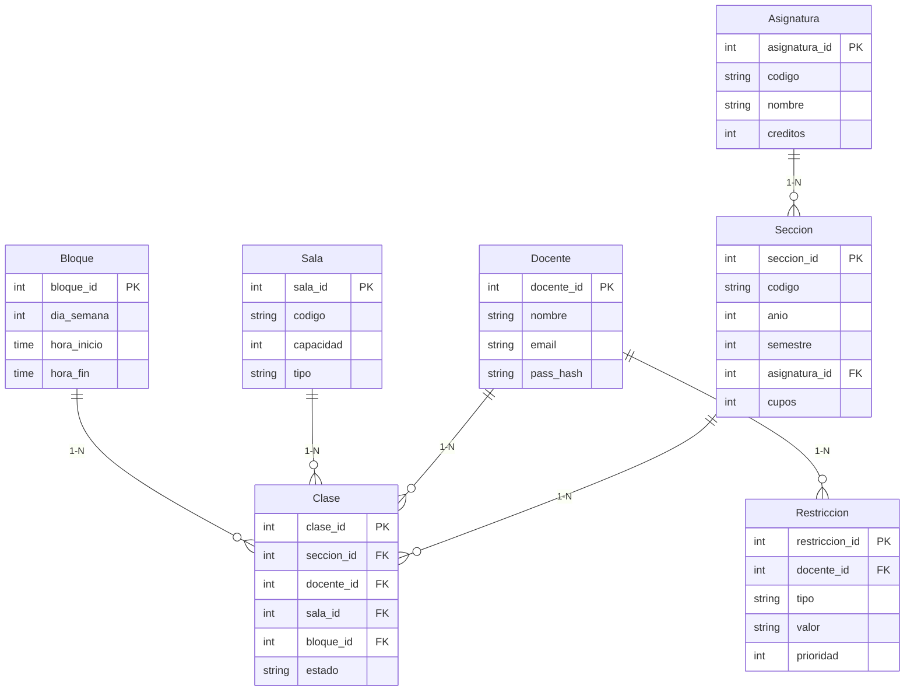

```mermaid
erDiagram
  Asignatura ||--o{ Seccion : "1-N"
  Seccion ||--o{ Clase : "1-N"
  Docente ||--o{ Clase : "1-N"
  Sala ||--o{ Clase : "1-N"
  Bloque ||--o{ Clase : "1-N"
  Docente ||--o{ Restriccion : "1-N"

  Docente { int docente_id PK
            string nombre
            string email
            string pass_hash }
  Asignatura { int asignatura_id PK
               string codigo
               string nombre
               int creditos }
  Seccion { int seccion_id PK
            string codigo
            int anio
            int semestre
            int asignatura_id FK
            int cupos }
  Sala { int sala_id PK
         string codigo
         int capacidad
         string tipo }
  Bloque { int bloque_id PK
           int dia_semana
           time hora_inicio
           time hora_fin }
  Clase { int clase_id PK
          int seccion_id FK
          int docente_id FK
          int sala_id FK
          int bloque_id FK
          string estado }
  Restriccion { int restriccion_id PK
                int docente_id FK
                string tipo
                string valor
                int prioridad }
```
