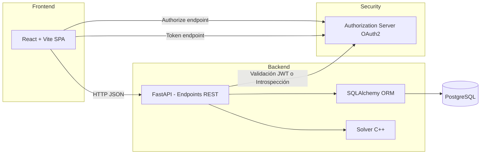

```mermaid
%%{init: {"flowchart": {"htmlLabels": true}} }%%
flowchart LR
  subgraph Frontend
    UI[React + Vite SPA]
  end

  subgraph Backend
    API[FastAPI - Endpoints REST]
    ORM[SQLAlchemy ORM]
    SOLVER[Solver C++]
  end

  subgraph Security
    AUTH[Authorization Server OAuth2]
  end

  DB[(PostgreSQL)]

  %% OAuth2 Authorization Code (SPA)
  UI -->|Authorize endpoint| AUTH
  UI -->|Token endpoint| AUTH
  UI -->|HTTP JSON| API
  API -->|Validación JWT o Introspección| AUTH

  %% Internos de la app
  API --> ORM
  API --> SOLVER
  ORM --> DB
```
