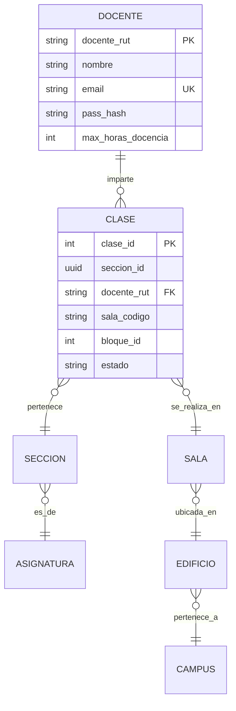

<div align="center">

# 🎓 GestionDocenteUCT

### Sistema de Gestión Docente - Universidad Católica de Temuco

*Proyecto de Integración II*

[](https://python.org)
[](https://postgresql.org)
[](https://sqlalchemy.org)
[](https://pydantic.dev)
[](https://reactjs.org)
[](https://vitejs.dev)

</div>

---

## 📋 Tabla de Contenidos

- [🎯 Descripción](#-descripción)
- [✨ Características](#-características)
- [🛠️ Tecnologías](#️-tecnologías)
- [🏗️ Arquitectura](#️-arquitectura)
- [🚀 Instalación](#-instalación)
- [📊 Base de Datos](#-base-de-datos)
- [🧪 Testing](#-testing)
- [📚 Documentación](#-documentación)
- [👥 Equipo](#-equipo)
- [🔗 Enlaces](#-enlaces)

---

## 🎯 Descripción

**GestionDocenteUCT** es un sistema integral para la gestión de docentes y asignación de clases en la Universidad Católica de Temuco. El proyecto implementa una arquitectura limpia (Clean Architecture) que permite una gestión eficiente de:

- 👨‍🏫 **Gestión de Docentes**: Registro, actualización y categorización
- 📚 **Asignación de Clases**: Control de horarios y disponibilidad
- 📊 **Reportes y Estadísticas**: Análisis de carga docente
- 🏢 **Gestión de Campus**: Edificios, salas y recursos

---

## ✨ Características

### 🔧 Funcionales
- ✅ **CRUD Completo de Docentes** con validaciones de negocio
- ✅ **Categorización Automática** por horas de trabajo (Completa/Media/Parcial)
- ✅ **Asignación Inteligente** de clases con control de disponibilidad
- ✅ **Estadísticas en Tiempo Real** del sistema
- ✅ **Búsqueda Avanzada** por múltiples criterios
- ✅ **Validación de Restricciones** académicas

### 🎨 Técnicas
- 🏗️ **Clean Architecture** con separación de capas
- 🔒 **Type Safety** con Pydantic y SQLAlchemy 2.0
- 🧪 **Testing Completo** con pytest
- 📦 **Inyección de Dependencias**
- 🔄 **Migrations** con Alembic
- 📊 **PostgreSQL** como motor de base de datos

---

## 🛠️ Tecnologías

### Backend
```yaml
Framework:     Clean Architecture + Python 3.9+
ORM:           SQLAlchemy 2.0.23+
Validación:    Pydantic 2.5.0+
Base de Datos: PostgreSQL 15+
Migrations:    Alembic 1.13.1+
Testing:       pytest 7.4.3+
```

### Frontend
```yaml
Framework:     React 18+
Build Tool:    Vite 5+
Language:      TypeScript/JavaScript
Styling:       CSS Modules / Styled Components
```

### DevOps & Tools
```yaml
Formateo:      Black + isort
Linting:       Flake8 + mypy
Pre-commit:    Hooks automatizados
CI/CD:         GitHub Actions (próximamente)
Containerización: Docker (próximamente)
```

---

## 🏗️ Arquitectura

```
📦 GestionDocenteUCT/
├── 🎯 app/
│   ├── 🔧 config/          # Configuración de BD y settings
│   ├── 🏛️ domain/          # Lógica de negocio
│   │   ├── models/         # Entidades SQLAlchemy
│   │   ├── schemas/        # Validaciones Pydantic
│   │   ├── factories/      # Patrones de creación
│   │   └── rules.py        # Reglas de negocio
│   ├── 🏗️ infrastructure/   # Persistencia y servicios externos
│   │   └── repositories/   # Acceso a datos
│   ├── 🚀 application/     # Casos de uso y servicios
│   │   └── services/       # Lógica de aplicación
│   └── main.py            # Punto de entrada
├── 🧪 tests/              # Suite de testing
├── 📚 docs/               # Documentación
└── 🎨 frontend/           # Aplicación React (próximamente)
```

### Principios Arquitectónicos

- **🎯 Domain-Driven Design**: El dominio dicta la estructura
- **🔄 Dependency Inversion**: Abstracciones sobre implementaciones
- **🧩 Single Responsibility**: Cada clase tiene una responsabilidad
- **🔒 Interface Segregation**: Interfaces específicas y cohesivas

---

## 🚀 Instalación

### Prerrequisitos
```bash
# Verificar versiones
python --version    # >= 3.9
psql --version     # PostgreSQL 12+
```

### 1️⃣ Clonar Repositorio
```bash
git clone https://github.com/tu-usuario/GestionDocenteUCT.git
cd GestionDocenteUCT
```

### 2️⃣ Configurar Entorno Virtual
```bash
# Crear entorno virtual
python -m venv venv

# Activar (Linux/Mac)
source venv/bin/activate

# Activar (Windows)
venv\Scripts\activate
```

### 3️⃣ Instalar Dependencias
```bash
# Dependencias de producción
pip install -r requirements.txt

# Dependencias de desarrollo
pip install -r requirements-dev.txt

# O usando pyproject.toml
pip install -e ".[dev]"
```

### 4️⃣ Configurar Variables de Entorno
```bash
# Copiar archivo de ejemplo
cp .env.example .env

# Editar configuración
nano .env
```

```env
# Configuración mínima requerida
DATABASE_USER=postgres
DATABASE_PASSWORD=tu_password
DATABASE_HOST=localhost
DATABASE_PORT=5432
DATABASE_NAME=gestion_docente_uct
```

### 5️⃣ Configurar Base de Datos
```bash
# Crear base de datos
createdb gestion_docente_uct

# Ejecutar migraciones
alembic upgrade head

# Inicializar tablas (desarrollo)
python -c "from app.config.database import init_db; init_db()"
```

### 6️⃣ Ejecutar Tests
```bash
# Tests completos
pytest

# Tests con cobertura
pytest --cov=app --cov-report=html

# Tests específicos
pytest tests/test_docente.py -v
```

---

## 📊 Base de Datos

### Modelo de Datos Principal



### Categorías de Docentes

| Categoría | Horas Mínimas | Horas Máximas |
|-----------|---------------|---------------|
| 🟢 **Jornada Completa** | 40 horas | 44 horas |
| 🟡 **Media Jornada** | 20 horas | 39 horas |
| 🔴 **Jornada Parcial** | 4 horas | 19 horas |

---

## 🧪 Testing

### Cobertura Actual
- 🎯 **Objetivo**: 90%+ cobertura
- ✅ **Domain Layer**: 95%+
- ✅ **Application Layer**: 90%+
- ⚠️ **Infrastructure Layer**: 85%+

---

## 📚 Documentación

### 📖 Recursos Disponibles

| Documento | Descripción | Estado |
|-----------|-------------|--------|
| [🏗️ Manual de Arquitectura](docs/manual_arquitectura.md) | Guía completa de arquitectura | ✅ Completo |
| [🔄 Flujo de Docentes](docs/flujo_docentes.md) | Casos de uso y operaciones | ✅ Completo |
| [📊 Modelo ER](https://www.mermaidchart.com/app/projects/bd96d597-d74a-46ab-898d-4e1683352121/diagrams/a9fbfefb-fe41-4325-93e9-fb365b497c2f/version/v0.1/edit) | Diagrama de base de datos | ✅ Actualizado |
| [🎨 Diseño UI/UX](https://www.figma.com/design/ZLHl9yM5ypwcp0QV7pWRFb/Dise%C3%B1o-GDU?node-id=0-1&t=fO9DcDzrdC0ghbuk-0) | Mockups y diseño | 🚧 En progreso |

### 🚀 API Reference (Próximamente)
```bash
# Generar documentación automática
sphinx-build -b html docs/ docs/_build/
```

---

## 👥 Equipo

### 👨‍💻 Desarrolladores
- **Backend Team**: Arquitectura, Base de Datos
- **Frontend Team**: Interfaz de usuario, UX/UI
- **QA Team**: Testing, Validación, Documentación

### 📞 Contacto
- 📧 **Email**: rrios2023@alu.uct.cl
- 🌐 **Universidad**: [Universidad Católica de Temuco](https://www.uct.cl)
- 📚 **Curso**: Proyecto de Integración II

---

## 🔗 Enlaces

### 📋 Gestión de Proyecto
- [📋 **Backlog**](https://www.notion.so/Gesti-n-Docente-UCT-GDU-25bca7fc8b6f80d49880e67f7b985edb?source=copy_link) - Notion Board
- [📁 **Drive**](https://drive.google.com/drive/folders/1r1rkUVznRMGfj4wYYARBF_iQPvK_hOJ6?usp=sharing) - Documentos compartidos

### 🛠️ Herramientas de Desarrollo
- [📊 **Diagrama ER**](https://www.mermaidchart.com/app/projects/bd96d597-d74a-46ab-898d-4e1683352121/diagrams/a9fbfefb-fe41-4325-93e9-fb365b497c2f/version/v0.1/edit) - Mermaid Chart
- [🎨 **Diseño UI**](https://www.figma.com/design/ZLHl9yM5ypwcp0QV7pWRFb/Dise%C3%B1o-GDU?node-id=0-1&t=fO9DcDzrdC0ghbuk-0) - Figma

---

<div align="center">

### 🌟 ¡Gracias por tu interés en GestionDocenteUCT!

*Si encuentras útil este proyecto, no olvides darle una ⭐*

**Desarrollado con ❤️ para la comunidad educativa**

---

*Universidad Católica de Temuco - 2025*

</div>
