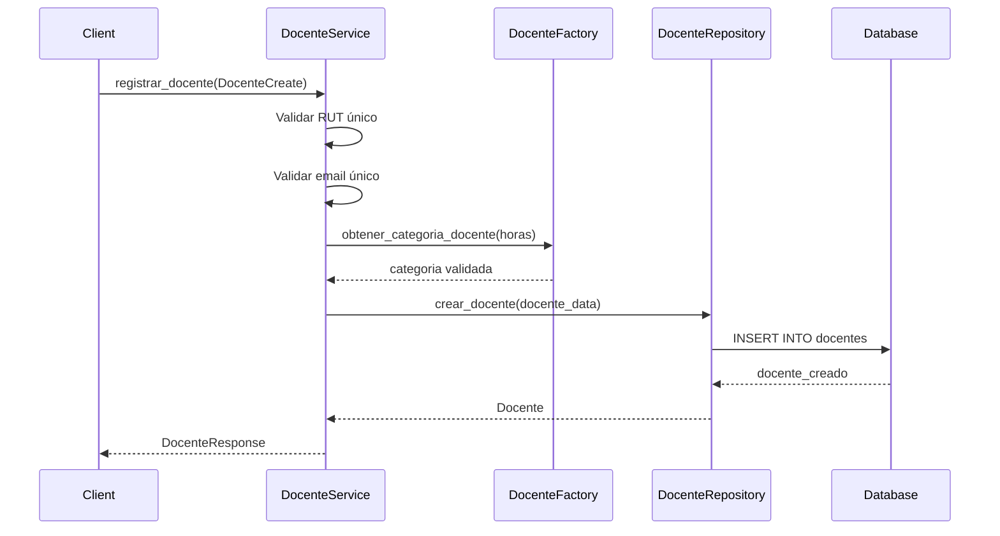
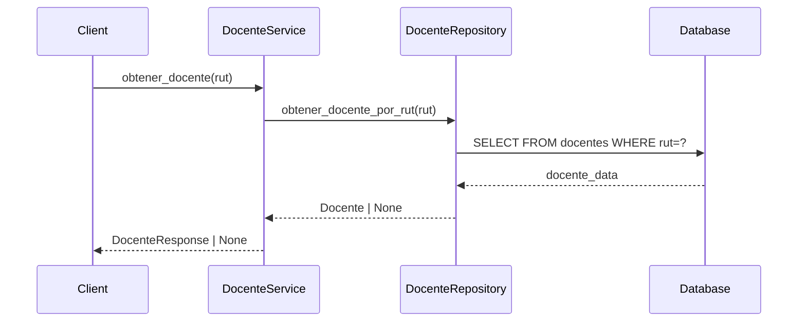
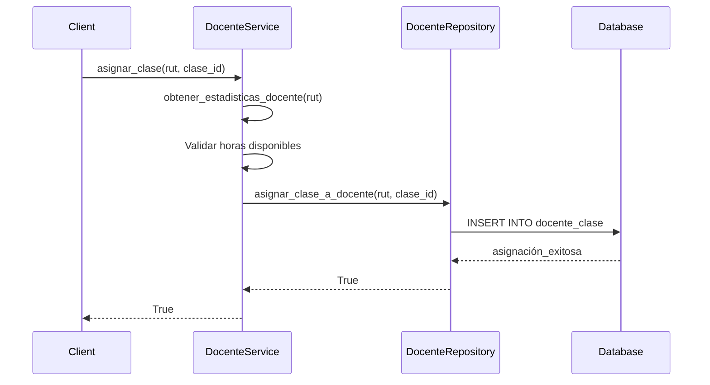
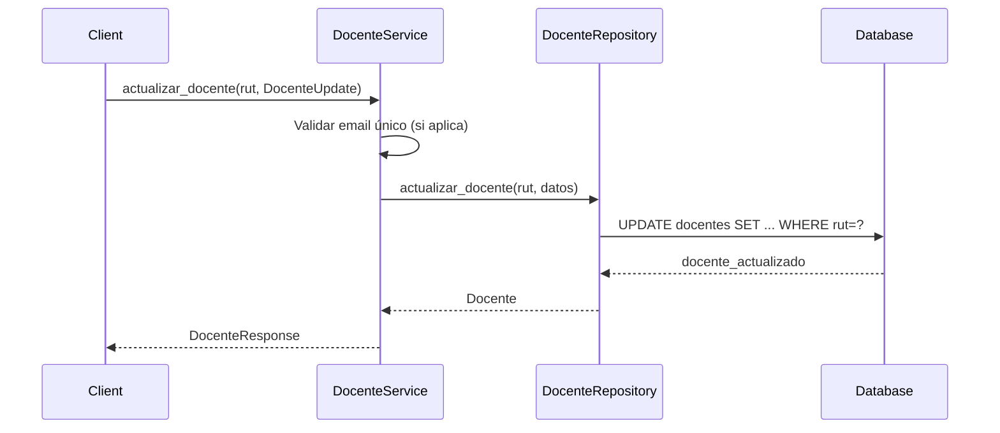
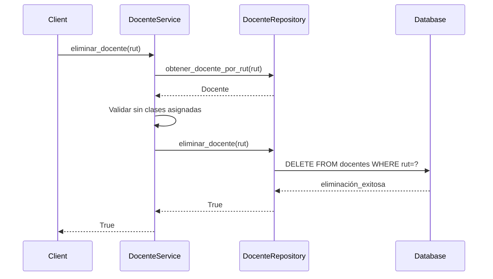

# Flujo de Operaciones - Gestión de Docentes

## Arquitectura del Sistema

### Capas del Sistema
```
┌─────────────────────────────────────┐
│          APPLICATION LAYER          │
│  ┌─────────────────────────────────┐ │
│  │      DocenteService             │ │ ← Casos de uso y lógica de negocio
│  └─────────────────────────────────┘ │
└─────────────────────────────────────┘
           │
           ▼
┌─────────────────────────────────────┐
│        INFRASTRUCTURE LAYER         │
│  ┌─────────────────────────────────┐ │
│  │     DocenteRepository           │ │ ← Persistencia y datos
│  └─────────────────────────────────┘ │
└─────────────────────────────────────┘
           │
           ▼
┌─────────────────────────────────────┐
│           DOMAIN LAYER              │
│  ┌───────────────┬─────────────────┐ │
│  │ Docente Model │ DocenteSchemas  │ │ ← Entidades y validaciones
│  └───────────────┴─────────────────┘ │
│  ┌─────────────────────────────────┐ │
│  │      DocenteFactory             │ │ ← Reglas de creación
│  └─────────────────────────────────┘ │
└─────────────────────────────────────┘
```

## Flujos de Operaciones

### 1. Registro de Docente



**Pasos del flujo:**
1. **Validación previa**: Verificar RUT y email únicos
2. **Validación de horas**: Usar DocenteFactory para categorizar
3. **Persistencia**: Crear registro en base de datos
4. **Respuesta**: Retornar datos del docente creado

### 2. Consulta de Docente



### 3. Asignación de Clase



### 4. Actualización de Docente



### 5. Eliminación de Docente



## Operaciones Disponibles

### Operaciones CRUD Básicas
- `registrar_docente()` - Crear nuevo docente
- `obtener_docente()` - Leer docente por RUT
- `actualizar_docente()` - Actualizar datos del docente
- `eliminar_docente()` - Eliminar docente del sistema

### Operaciones de Consulta
- `listar_docentes()` - Listar con paginación
- `buscar_docentes()` - Búsqueda por nombre
- `obtener_docentes_disponibles()` - Docentes con horas libres

### Operaciones de Asignación
- `asignar_clase()` - Asignar clase a docente
- `desasignar_clase()` - Quitar clase de docente

### Operaciones de Estadísticas
- `obtener_estadisticas_docente()` - Stats individual
- `obtener_resumen_sistema()` - Stats generales del sistema

## Validaciones de Negocio

### Al Registrar Docente
- RUT único en el sistema
- Email único en el sistema
- Horas mínimas según categoría:
  - Jornada Completa: ≥ 40 horas
  - Media Jornada: ≥ 20 horas
  - Jornada Parcial: ≥ 4 horas
- Máximo 44 horas permitidas

### Al Asignar Clase
- Docente debe existir
- Clase debe existir
- Docente debe tener horas disponibles
- No duplicar asignaciones

### Al Eliminar Docente
- No debe tener clases asignadas
- Debe existir en el sistema

## Categorización de Docentes

```python
# Categorías según horas mínimas
CATEGORIAS = {
    "Jornada Completa": 40+,  # 40 o más horas
    "Media Jornada": 20-39,   # 20 a 39 horas
    "Jornada Parcial": 4-19   # 4 a 19 horas
}
```

## Manejo de Errores

### Errores Comunes y Respuestas
- **RUT duplicado**: `ValueError("Ya existe un docente con RUT: ...")`
- **Email duplicado**: `ValueError("Ya existe un docente con email: ...")`
- **Horas insuficientes**: `ValueError("El docente no tiene horas disponibles suficientes")`
- **Docente con clases**: `ValueError("No se puede eliminar un docente que tiene clases asignadas")`
- **Docente no encontrado**: Retorna `None` en lugar de excepción

### Transacciones
- Uso de transacciones de base de datos
- Rollback automático en caso de error
- Sesiones manejadas por el repositorio

## Ejemplo de Uso

```python
# Inicializar servicio
servicio = DocenteService()

# Registrar docente
docente_data = DocenteCreate(
    docente_rut="12345678-9",
    nombre="Juan Pérez",
    email="juan.perez@uct.cl",
    pass_hash="hashed_password",
    max_horas_docencia=40
)
docente = servicio.registrar_docente(docente_data)

# Obtener estadísticas
stats = servicio.obtener_estadisticas_docente("12345678-9")

# Asignar clase
servicio.asignar_clase("12345678-9", 123)

# Cerrar servicio
servicio.close()
```
